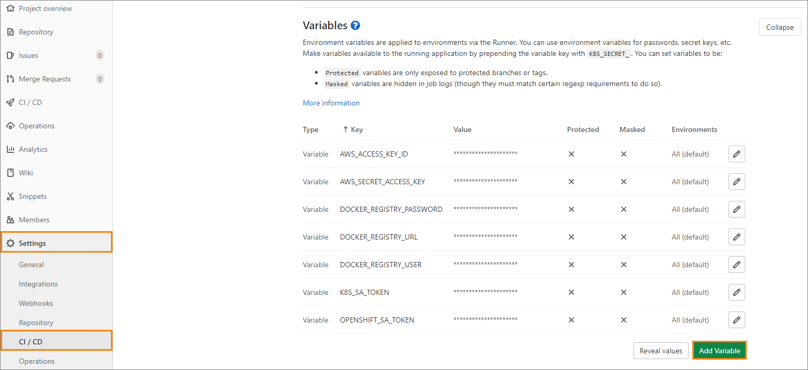
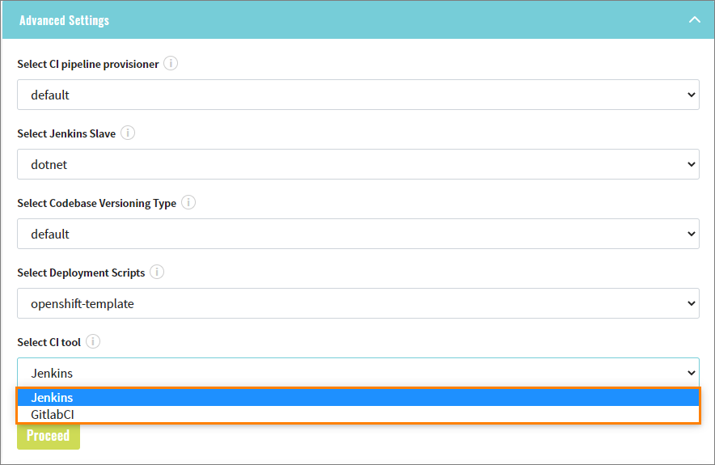
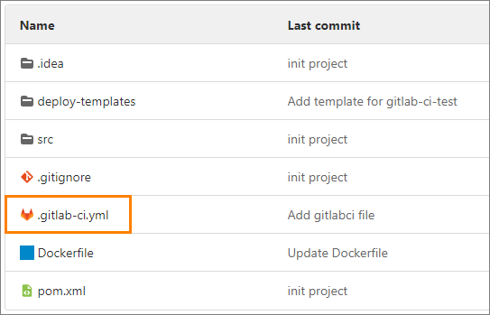

# Adjust CI tool

Prerequisites for using GitlabCI:
* You must add environment variables to your project.
   >*Note: According to cluster (Openshift/Kubernetes) variables will be differ.*

* To add variables, go to **Settings->CI/CD->Expand Variables->Add variable**
    
    
                          
* Openshift:

    **DOCKER_REGISTRY_URL**      - URL to Openshift docker registry;
    
    **DOCKER_REGISTRY_PASSWORD** - it's a token from SA who has an access to registry;
    
    **DOCKER_REGISTRY_USER**     - user name;
    
    **OPENSHIFT_SA_TOKEN**       - token which can be used to log in to Openshift;
    
    >*Note: Most likely, you will be use SA to get an access to docker registry and Openshift, so any credentials you can find by describing SA and get secrets under **secrets** block:*
    
    
                                                                                                                                                             
* Kubernetes:

    **DOCKER_REGISTRY_URL** - URL to Amazon ECR;
    
    **AWS_ACCESS_KEY_ID** - auto IAM user access key;
    
    **AWS_SECRET_ACCESS_KEY** - auto IAM secret access key;
    
    **K8S_SA_TOKEN** - token which can be used to log in to Kubernetes;
    
   >*Note: To get an access to ECR you must have auto IAM user which has rights to push/create repository.*
                            
In order to use the Jenkins or Gitlab CI, you must: 
   >*Note: You can select CI only using Import strategy.*

1. Select CI type in Advanced Settings during codebase creation:

    

2. Once your codebase is provisioned you will see **.gitlab-ci.yml** file in repository which describes pipeline (stages and them logic):

    
