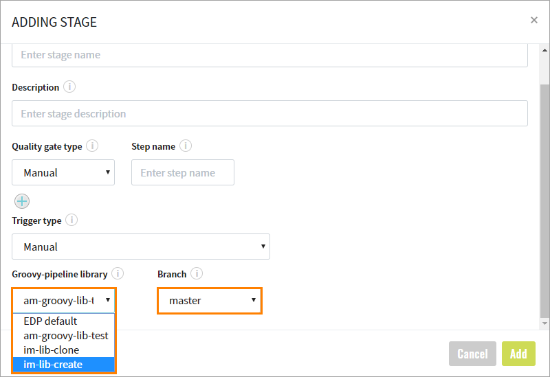

# Customize CD Pipeline

Apart from running CD pipeline stages with the default logic, there is the ability to perform the following:
* Create your own logic for stages;
* Redefine the default EDP stages of a CD pipeline.

In order to have the ability to customize a stage`s logic, create a CD pipeline stage source as a Library:
1. Create a library in Admin Console with the "Groovy-pipeline" code language:

2. Create a CD pipeline with the library stage`s source and its branch:


## Add New Stage

Follow the steps below to add a new stage:
- Clone the repository with the added library;
- Create a "stages" directory in the root;
- Create a groovy file with a meaningful name, e.g. NotificationStage.groovy;
- Put the required construction and your own logic into the file:
```
import com.epam.edp.stages.impl.cd.Stage
 
@Stage(name = "notify")
class Notify {
    Script script
    void run(context) {
    --------------- Put your own logic here ------------------
            script.println("Send notification logic")
    --------------- Put your own logic here ------------------
    }
}
return Notify
```
- Add a new stage to the STAGES parameter of the Jenkins job of your CD pipeline:

- Run the job to check that your new stage has been run during the execution.

## Redefine Existing Stage

By default, the following stages are implemented in EDP pipeline framework:
- deploy,
- deploy-helm,
- autotests,
- manual (Manual approve),
- promote-images,
- promote-images-ecr.

If you use one of these names for annotation in your own class, it will lead to redefining the default logic with your own.

Find below a sample of the possible flow of the redefining deploy stage:
- Clone the repository with the added library;
- Create a "stages" directory in the root;
- Create a Jenkinsfile with default content:
```
@Library(['edp-library-stages', 'edp-library-pipelines']) _

Deploy()
```
- Create a groovy file with a meaningful name, e.g. CustomDeployStage.groovy;
- Put the required construction and your own logic into the file:
```
import com.epam.edp.stages.impl.cd.Stage
 
@Stage(name = "deploy")
class CustomDeployStage {
    Script script

    void run(context) {
    --------------- Put your own logic here ------------------
            script.println("Custom deploy stage logic")
    --------------- Put your own logic here ------------------
    }
}
return CustomDeployStage
```