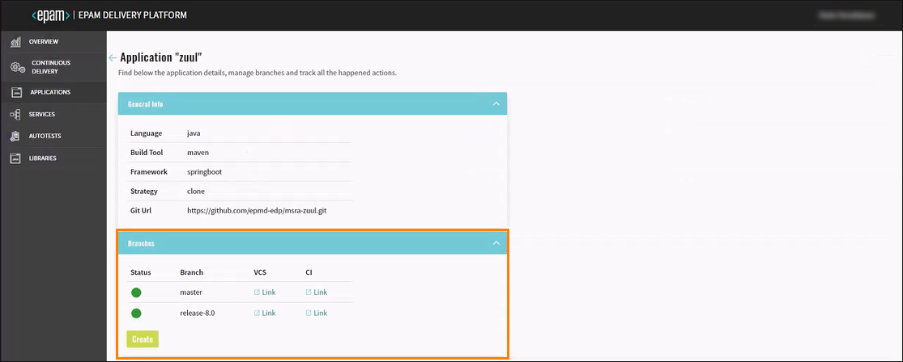
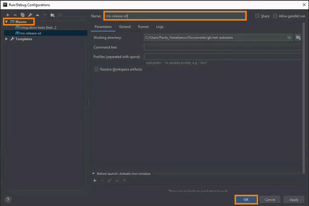
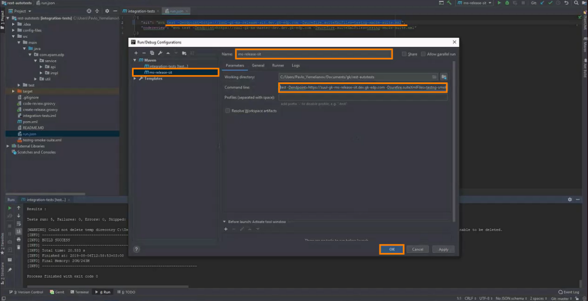
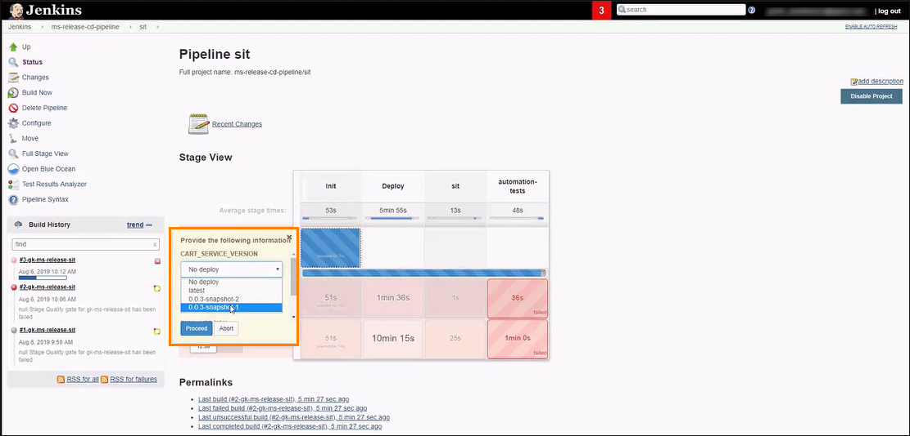
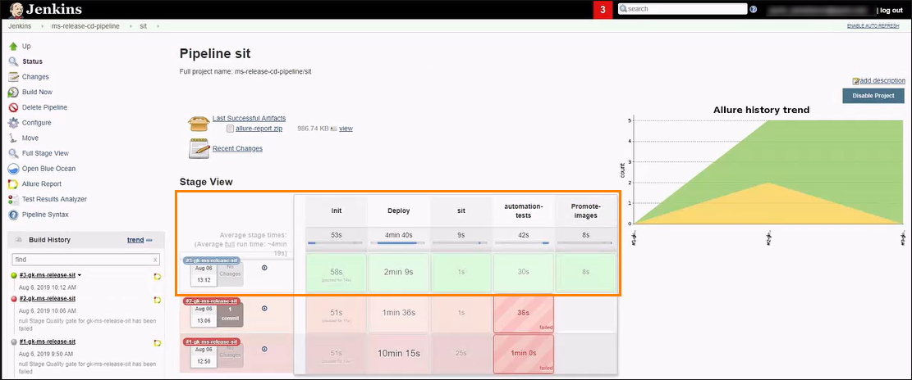

# Run Functional Autotests 

This chapter describes the process of adding, configuring, and running autotests. Run the added autotest on the deployed 
environment or add it to a newly created CD pipeline stage.
Explore the process of launching the autotest locally, review the successful and unsuccessful Allure reports, and resolve 
the encountered issue. 

* [The Predefined EDP Entities](#the_predefined_edp_entities)
* [Add and Configure an Autotest](#add_configure_autotest)
* [Local Launch of Autotests](#local_launch_autotest)
* [Add an Autotest to a New CD Pipeline](#add_autotest_to_cd_pipe)
* [Deploy SIT Stage](#deploy_sit_stage)

## The Predefined EDP Entities <a name="the_predefined_edp_entities"></a>

Explore the predefined EDP entities:
1.	Three applications: cart-service, order-service, and zuul:
     
2. Every application has two branches:
     
3. One CD pipeline with the DEV stage and a manual approve of the trigger type:
     
4. The project deployment of the ms-master CD pipeline in OpenShift:
     
5. The endpoint by the service status path of the master branch returns the following text: OK!
6. The endpoint of the release-8.0 branch should return the following text: !!OK!

## Add and Configure an Autotest <a name="add_configure_autotest"></a>

Follow the steps below to add an autotest using Admin Console and to configure it in Gerrit within the deployed environment:
1. Open the Admin Console and add an autotest:

      
     >_**NOTE**: To get more information on how to add autotests, please refer to the [Add Autotests](https://github.com/epmd-edp/admin-console/blob/master/documentation/add_autotests.md#add-autotests) instruction._

2. After the provisioning of the new autotest is successfully completed, implement the necessary configuration 
for the added autotest. Open Gerrit via the Admin Console overview page → select the created autotest:
     
3. Navigate to the **Branches** tab and click the gitweb of the master branch: 
      
4. Switch to the tree tab and open the **run.json** file:
      
5. Explore the **run.json** file where the stage is the key, the value is the command to run:  
    ```bash
   {
    "sit": "mvn test -Dendpoint=https://zuul-gk-ms-release-sit.dev.gk-edp.com -Dsurefire.suiteXmlFiles=testng-smoke-suite.xml",
    "codereview": "mvn test -Dendpoint=https://zuul-gk-ms-master-dev.dev.gk-edp.com -Dsurefire.suiteXmlFiles=testng-smoke-suite.xml"
    }
    ```
    >**INFO**: Continuous Integration is used when verifying the added to autotests changes that`s why the "codereview" key should be added. 
The "codereview" key is the **mandatory** and will be used during the Code Review pipeline processing to autotest itself by triggering 
when pushing a new code to the repository.

6. Create change using the Gerrit web console: open the rest-autotests project → create change → click the Publish button → 
hit Edit and Add → type the run.json to open this file.
      
7. Open the deployed environment in OpenShift and copy the external URL address for zuul application:  
    
8. Define another command value by pasting the copied URL address, click Save and then Publish button to trigger the CI pipeline in Jenkins:
     
9. Click the respective link to Jenkins in the History block to check that the Code Review pipeline is triggered:
     
10. Wait for the Code Review pipeline to be successfully passed and click the Allure report link to verify the autotests results: 
      
    >**INFO**: The autotests pass only the Code Review pipeline. 
11. Explore the results in Allure by clicking the EDP SIT Tests link:
    
12. Navigate between the included autotests and check the respective results:
     
13. Return to Gerrit, which already displays the appropriate marks, and merge the changes by clicking the Code-Review+2 and Submit buttons. 

## Local Launch of Autotests <a name="local_launch_autotest"></a>

There is an ability to run the autotests locally using the IntelliJIDEA application. To launch the rest-autotests project for the local verification, perform the following steps:
1. Clone the project to the local machine.
    
2. Open the project in IntelliJIDEA and find the **run.json** file to copy out the necessary command value, then click the Add Configuration button, hit the plus sign → go to Maven and paste the copied command value into the Command line field→ click Apply and OK → hit the necessary button to run the added command value:
     
3. As a result, all launched tests will be successfully passed:
     
    
## Add an Autotest to a New CD Pipeline <a name="add_autotest_to_cd_pipe"></a>

Add an additional CD pipeline and define two stages (SIT - System Integration Testing and QA - Quality Assurance) with the different Quality Gate types. Pay attention that the QA stage will be able to be launched only after the SIT stage is completed. 

1.	Add a new CD pipeline (e.g. under the ms-release name).
2.	Select all three applications and specify the release-8.0 branch:
      
3. Add SIT stage by defining the **Autotests** type in the Quality gate type field, and select the respective check box as well:
    
4. Add the QA stage and define the **Manual** type in the Quality gate type field. 
5. Select the RabbitMQ service in the Services menu (the selected service will be deployed on this new CD pipeline).
    >_**NOTE**: To get more information on how to add the CD pipeline, please refer to the [Add CD Pipelines](https://github.com/epmd-edp/admin-console/blob/master/documentation/add_CD_pipelines.md#add-cd-pipelines) chapter._ 

6. As soon as the CD pipeline is provisioned, the details page will display the added stages with the corresponding quality gate types. Click the CD pipeline name on the top of the details page:
     
7. Being navigated to Jenkins, select the SIT stage and trigger it by clicking the Build Now option from the left-side panel, and define the necessary version on the Initialization stage:
     
    >**INFO**: To trigger the CD pipeline, first, be confident that all applications have passed the Build pipelines and autotests have passed the single Code Review pipelines.   
8. The SIT stage will not be passed successfully as the mentioned endpoint doesn`t exist. 
To resolve the issue, apply the configuration using IntelliJIDEA (_see above the additional information on how to make changes locally: [Local Launch of Autotests](#local_launch_autotest)_;
9. Being in IntelliJIDEA, click Edit Configuration → Maven → type the name - ms-release-sit → click OK:  
     
10. Find the **run.json** file to copy out the necessary command value for SIT stage, then click the Edit Configuration button → go to Maven ms-release-sit and paste the copied command value into the Command line field→ click Apply and OK:
     
11. Push the changes to send them for review to Gerrit and submit the changes.
12. After the changes are added, the SIT stage should be triggered one more time. Open Jenkins and click the Build Now option from the left-side panel, then select the latest version in the appeared notification during the Initialization stage. 
As a result, the triggered pipeline won`t be passed. Click the Allure link to get more information about the issues:
     
    
13. The Allure report displays the failed tests and explains the failure reason. In the current case, the expected string doesn`t match the initial one: 
     

## Deploy SIT Stage <a name="deploy_sit_stage"></a>

The pipeline can be failed due to the version that was selected for deployment. This version includes the new mentioned 
changes that affected the pipeline processing. In order to resolve this issue and successfully deploy the CD pipeline, 
a developer/user should choose the previous version without new changes. To do this, follow the steps below:

1. Open Jenkins and trigger the SIT stage one more time, select the **previous** version on the Initialization stage:
    
2. As soon as the automation-tests stage is passed, check the Allure report:
     
3. After the Promote-images stage is completed on the SIT stage, the QA stage can be triggered and deployed as the Docker images were promoted to the next stage: 
     
As a result, the SIT stage will be deployed successfully, thus allowing to trigger the next QA stage.