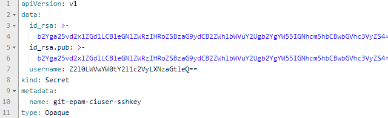
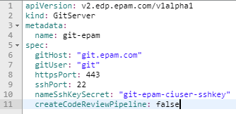
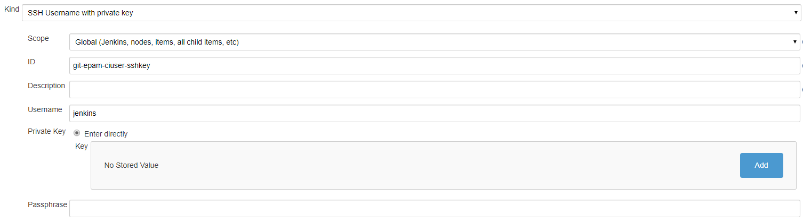
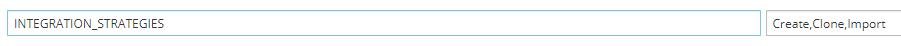

## Add GitServer CR

1. Create Secret in OpenShift/K8S namespace to the Git account with the fields: **id_rsa**, **id_rsa.pub**, and **username**:

    

2. Create GitServer CR in OpenShift/K8S namespace with the following fields: **gitHost**, **gitUser**, **httpsPort**, **sshPort**, **nameSshKeySecret**, **createCodeReviewPipeline**:

    

    *Note: The value of the **nameSshKeySecret** property is the name of the Secret that is indicated in the first point above.*
3. Create a Credential in Jenkins with the same ID as in the **nameSshKeySecret** property, and with the private key. Navigate by **Jenkins-> Credentials->System->Global credentials->Add Credentials** path

    
    
4. Change the Deployment Config of the Admin Console by adding the **Import** strategy to the **INTEGRATION_STRATEGIES** variable. As soon as the Admin Console is redeployed, the **Import** strategy will be added to the Create Application page:

    