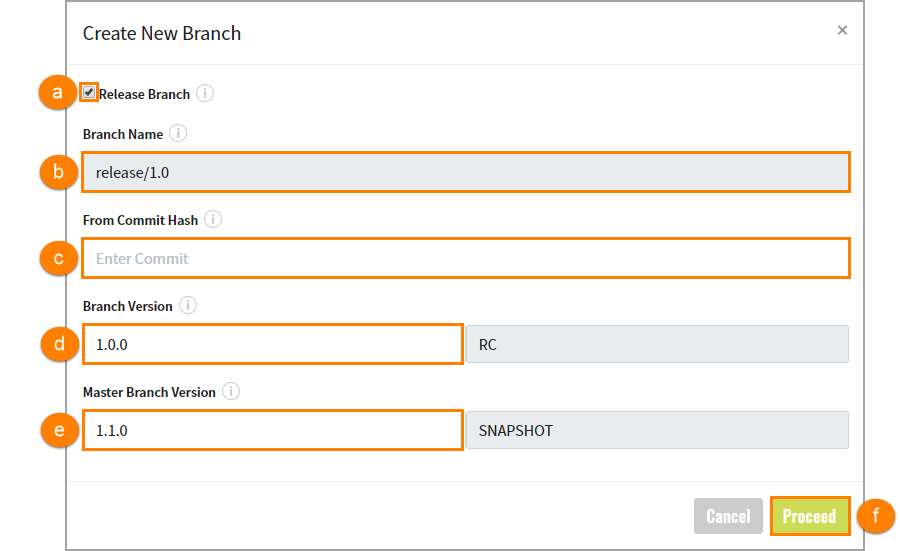

# Inspect Autotest
    
This section describes the subsequent possible actions that can be performed with the newly added or existing autotests.

## Check and Remove Autotest

As soon as the autotest is successfully provisioned, the following will be created:
                                                      
- Code Review and Build pipelines in Jenkins for this autotest. The Build pipeline will be triggered automatically if at least one environment is already added.
- A new project in Gerrit or another VCS.
- SonarQube integration will be available after the Build pipeline in Jenkins is passed.
- Nexus Repository Manager will be available after the Build pipeline in Jenkins is passed as well.

_**INFO:** To navigate quickly to OpenShift, Jenkins, Gerrit, SonarQube, Nexus, and other resources, click the Overview section on the navigation bar and hit the necessary link._

The added autotest will be listed in the Autotests list allowing you to do the following:

1. Add another autotest by clicking the Create button and performing the same steps as described [here](documentation/add_autotests.md);
2. Remove autotest with the corresponding database and Jenkins pipelines:
    - Click the delete icon next to the autotest name;
    - Type the required autotest name;
    - Confirm the deletion by clicking the Delete button.
    
    _**NOTE**: The autotest that is used in a CD pipeline cannot be removed._

3. Open autotest data by clicking its link name. Once clicked, the following blocks will be displayed:
 
    * **General Info** - displays common information about the cloned/imported autotest.
    * **Advanced CI Settings** - displays the specified job provisioner, Jenkins slave, deployment script, and the versioning type with the start versioning from number (the latter two fields appear in case of edp versioning type).
    * **Branches** - displays the status and name of the deployment branch, keeps the additional links to Jenkins and Gerrit. In case of edp versioning type, there are two additional fields:
         
         * **Build Number** - indicates the current build number; 
         * **Last Successful Build** - indicates the last successful build number.
    * **Status Info** - displays all the actions that were performed during the cloning/importing process.
    
## Add a New Branch

When adding an autotest, the default branch is a **master** branch. In order to add a new branch, follow the steps below:

1. Navigate to the **Branches** block and click the Create button:

    
    
2. Fill in the required fields:
    
    
    
    a. Release Branch - select the Release Branch check box if you need to create a release branch;
    
    b. Branch Name - type the branch name. Pay attention that this field remain static if you create a release branch. 
    
    c. From Commit Hash - paste the commit hash from which the new branch will be created. Note that if the From Commit Hash field is empty, the latest commit from the branch name will be used.
    
    d. Branch Version - enter the necessary branch version for the artifact. The Release Candidate (RC) postfix is concatenated to the branch version number. 
    
    e. Master Branch Version - type the branch version that will be used in a master branch after the release creation. The Snapshot postfix is concatenated to the master branch version number;
    
    f. Click the Proceed button and wait until the new branch will be added to the list.

>_**INFO**: Adding of a new branch is indicated in the context of the edp versioning type. To get more detailed information on how to add a branch using the default versioning type, please refer [here](https://github.com/epmd-edp/admin-console/blob/master/documentation/add_autotests.md#-check-autotest-availability)._

The default autotest repository is cloned and changed to the new indicated version before the build, i.e. the new indicated version will not be committed to the repository; thus, the existing repository will keep the default version.

## Remove Branch

In order to remove the added branch with the corresponding  record in the Admin Console database, do the following:

1. Navigate to the Branches block by clicking the autotest name link in the Autotests list;
2. Click the delete icon related to the necessary branch:

    
    
3. Enter the branch name and click the Delete button;

_**NOTE**: The default **master** branch cannot be removed._

### Related Articles

* [Add Autotests](documentation/add_autotests.md)