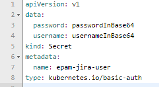
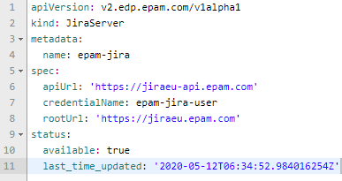
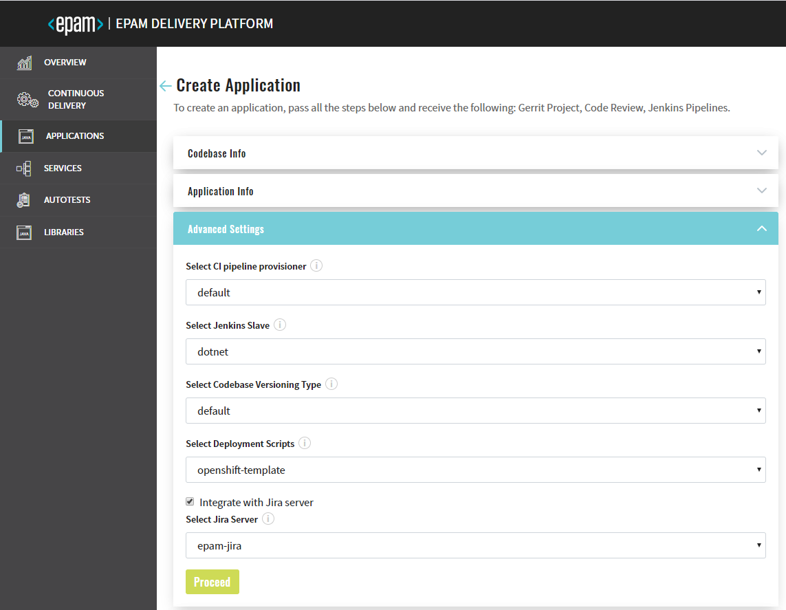

# Adjust Integration with Jira Server

In order to integrate with Jira server, make sure to add JiraServer CR by following steps:

1. Create Secret in the OpenShift/K8S namespace for Jira Server account with **username** and **password** fields:

    
 
2. Create JiraServer CR in the OpenShift/K8S namespace with the **apiUrl**, **credentialName** and **rootUrl** fields:

    
    
    >*Note: The value of the **credentialName** property is the name of the Secret that is indicated in the first point above.*
                                                                                                                                                                                                    >
3. As soon as everything is configured refer 

    

