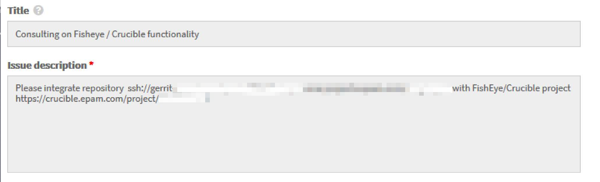

# Adjust VCS Integration With Jira Server

In order to adjust the Version Control System integration with Jira Server, first make sure you have the following prerequisites:

* VCS Server
* Jira
* Crucible

When checked the prerequisites, follow the steps below to proceed with the integration:

1. Configure the [Jira](https://jiraeu.epam.com) integration with [Crucible](https://crucible.epam.com/) by creating a standard request in [EPAM Support Portal](https://support.epam.com/).

2. Integrate every project in Gerrit with every project in [Crucible](https://crucible.epam.com/) by creating a corresponding request in [EPAM Support Portal](https://support.epam.com/esp/ess.do?orderitem=caConsultancyinFisheyeCruciblefunctionality):

      
    
3. To link commits with Jira ticket, being in Gerrit, enter a Jira ticket ID in a commit message using the specific format: 
**[PROJECT-CODE-1234]: commit message**, where PROJECT-CODE is a specific code of a project, 1234 is an ID number, and a commit message.  

4. As a result, all Gerrit commits will be displayed on [Crucible](https://crucible.epam.com/).