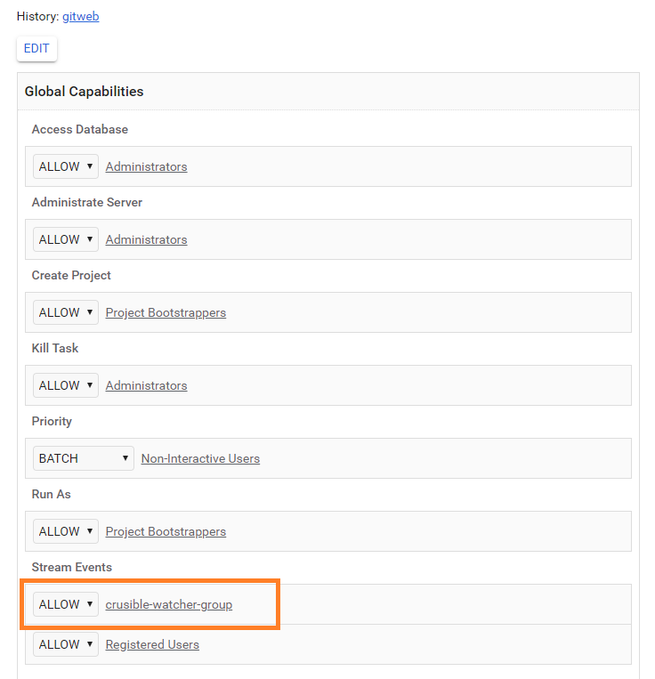

# Adjust VCS Integration With Jira Server

In order to adjust the Version Control System integration with Jira Server, first make sure you have the following prerequisites:

* VCS Server
* Jira
* Crucible

When checked the prerequisites, follow the steps below to proceed with the integration:

1. Integrate every project in VCS Server with every project in [Crucible](https://crucible.epam.com/) by creating a corresponding request in [EPAM Support Portal](https://support.epam.com/esp/ess.do?orderitem=caConsultancyinFisheyeCruciblefunctionality).
This request must be approved by key staff,  so add them in Keep informed field:

      
    
2. A support team will contact you to request details.
    
3. To link commits with Jira ticket, being in Gerrit, enter a Jira ticket ID in a commit message using the specific format: 
**[PROJECT-CODE-1234]: commit message**, where PROJECT-CODE is a specific code of a project, 1234 is an ID number, and a commit message.  

4. As a result, all Gerrit commits will be displayed on [Crucible](https://crucible.epam.com/):

    
    
## Case for integration with Gerrit

1. Create new user in Gerrit "crucible-<project_name>" with SSH key and add new user in Gerrit group "Non-Interactive Users".
2. Create new group in Gerrit "crucible-watcher-group" and add "crucible-<project_name>" user in it.
3. Provide access for All-Projects for group "crucible-watcher-group":

    
    

4. After the actions are completed, return to the step of creating a request to support.     

