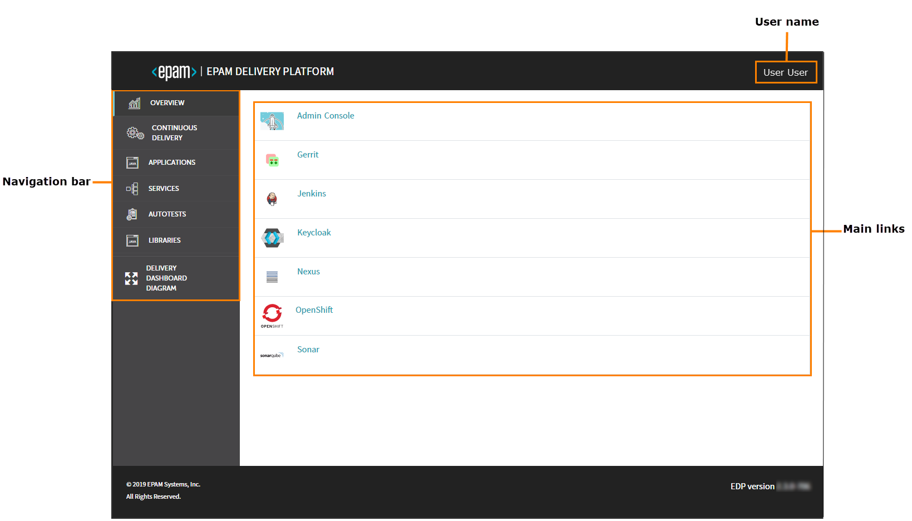

# EDP Admin Console
## Overview
Admin Console is a central management tool in the EDP ecosystem that provides the ability to deploy infrastructure, project resources and new technologies in a simple way. 
Using Admin Console enables to manage business entities:
* Create Codebases as Applications, Libraries and Autotests;
* Create/Update CD Pipelines;

_**NOTE**: To interact with Admin Console via REST API, explore the [Create Codebase Entity](documentation/rest-api.md) page._

 

- <strong>Navigation bar </strong>– consists of six sections: Overview, Continuous Delivery, Applications, Services, Autotests, and Libraries. Click the necessary section to add an entity or open a home page.
- <strong>User name</strong> – displays the registered user name. 
- <strong>Main links</strong> – displays the corresponding links to the major adjusted toolset, to the management tool and to the OpenShift cluster.

Admin Console is a complete tool allowing to manage and control the added applications, services, autotests, and libraries to the environment as well as to create a CD pipeline and perform the following actions:

1. [Add Applications](documentation/add_applications.md)
2. [Add Services](documentation/add_services.md) 
3. [Add Autotests](documentation/add_autotests.md) 
4. [Add Libraries](documentation/add_libraries.md)
5. [Add CD Pipelines](documentation/add_CD_pipelines.md)
6. [Adjust Import Strategy](documentation/import-strategy.md)

_**NOTE**: The Admin Console link is available on the OpenShift overview page for your CI/CD project._

### Related Articles

* [Local Development](documentation/local_development.md)
